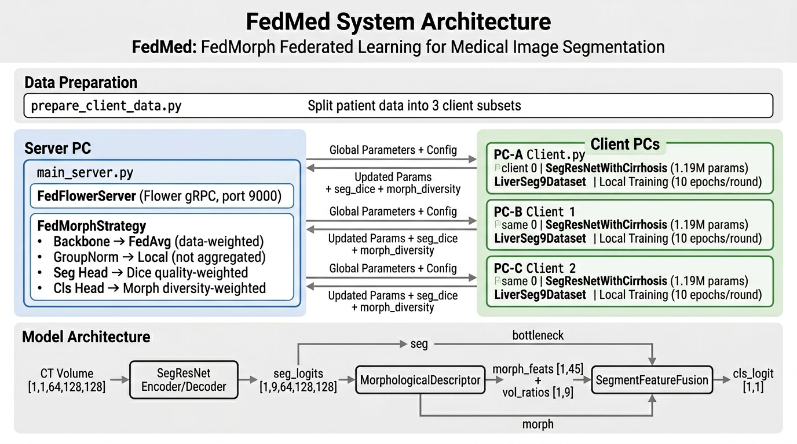

# FedMed

**FedMorph — Morphology-Aware Federated Learning for Medical Image Segmentation**

각 병원의 데이터는 외부로 반출되지 않고, 모델 가중치만 서버와 주고받는 실제 연합학습 구조.

## Architecture



```
┌──────────────────────────────────────────────────────────────────┐
│                                                                  │
│   병원 A (Client)          서버              병원 B (Client)      │
│   ┌──────────────┐    ┌──────────┐    ┌──────────────┐          │
│   │ 자체 CT 데이터 │    │ 데이터 없음 │    │ 자체 CT 데이터 │          │
│   │ 로컬 학습     │◄──►│ 모델 집계  │◄──►│ 로컬 학습     │          │
│   │ 가중치만 전송  │    │ 재배포     │    │ 가중치만 전송  │          │
│   └──────────────┘    └──────────┘    └──────────────┘          │
│                            ▲                                     │
│                            │                                     │
│                       ┌──────────────┐                          │
│                       │ 자체 CT 데이터 │                          │
│                       │ 로컬 학습     │                          │
│                       │ 가중치만 전송  │                          │
│                       └──────────────┘                          │
│                       병원 C (Client)                           │
│                                                                  │
└──────────────────────────────────────────────────────────────────┘
```

- **Model**: MONAI SegResNet + MorphologicalDescriptor (~1.2M params)
- **FL Framework**: [Flower](https://flower.ai/) (gRPC)
- **핵심**: 데이터는 각 병원에 머무르고, 모델 파라미터만 네트워크로 전송

| Parameter Group | Aggregation Strategy |
|----------------|---------------------|
| Backbone + GroupNorm | Data-size weighted average (FedAvg) |
| Segmentation head (`conv_final`) | Per-segment Dice quality × data-size weighted |

## Supported FL Methods

| Method | Description |
|--------|-------------|
| `FedAvg` | Standard weighted average |
| `FedProx` | FedAvg + proximal regularization term |
| `FedBN` | FedAvg with local normalization layers |
| `FedMorph` | Anatomy-Decoupled Aggregation (proposed) |

---

## Data Format

각 클라이언트(병원) PC의 **로컬 데이터 폴더** 안에 환자별 하위 폴더가 있어야 합니다.
별도의 메타파일(patient.json 등)은 필요 없습니다 — 자동으로 스캔합니다.

```
D:\data\liver_ct\               ← 각 병원의 로컬 경로
├── patient_001/
│   ├── image.npy              # CT volume, shape: (D, H, W)
│   └── mask.npy               # Segmentation mask, shape: (C, D, H, W)
├── patient_002/
│   ├── image.npy
│   └── mask.npy
└── ...
```

> 폴더명이 곧 환자 ID입니다. 어떤 이름이든 상관없습니다.

**mask.npy 채널 구성** (C >= 10):
- `mask[0]`: background
- `mask[1]` ~ `mask[9]`: 9개 간 세그먼트 (seg1 ~ seg8)

---

## 실행 가이드

### Step 1. 환경 설치 (모든 PC)

```bash
git clone https://github.com/AISeedHub/FedMed.git
cd FedMed
uv sync
```

### Step 2. 데이터 검증 (각 클라이언트 PC)

학습 전에 로컬 데이터가 올바른 형식인지 확인합니다.

```bash
uv run python src/use_cases/liver_segmentation/prepare_client_data.py \
    --data-dir D:\data\liver_ct
```

출력 예시:

```
Found 25 patients. Validating...

Validation: 25 OK, 0 with issues

Train/Val Split Preview
  Train: 21 patients
  Val:   4 patients
  Ratio: 84% / 16%

Ready for Federated Learning
```

### Step 3. 서버 실행 (서버 PC)

서버를 **먼저** 실행합니다. 서버에는 **데이터가 필요 없습니다**.

```bash
# Linux
./src/run_liver_server.sh

# Windows
src\run_liver_server.bat
```

또는 직접:

```bash
uv run python src/use_cases/liver_segmentation/main_server.py
```

서버가 시작되면:

```
FedMorph - Liver Segmentation Server
============================================================
  Method:       FedMorph
  Rounds:       50
  Min Clients:  3
============================================================
Listening on 0.0.0.0:9000
Waiting for 3 clients to connect ...
```

### Step 4. 클라이언트 실행 (각 병원 PC)

서버 IP를 지정하여 실행합니다. **순서 무관**, 각자 로컬 데이터를 자동 스캔합니다.

```bash
# Windows
src\run_liver_client.bat 192.168.1.100:9000 D:\data\liver_ct

# Linux
./src/run_liver_client.sh 192.168.1.100:9000 /data/liver_ct
```

또는 직접:

```bash
uv run python src/use_cases/liver_segmentation/main_client.py \
    --server-address 192.168.1.100:9000 \
    --data-dir D:\data\liver_ct
```

**데이터 경로 지정 방법 (우선순위 순):**

| 방법 | 예시 |
|------|------|
| 커맨드라인 인자 | `--data-dir D:\data\liver_ct` |
| 환경변수 | `set FEDMORPH_DATA_DIR=D:\data\liver_ct` |
| config YAML | `data_dir: "D:\data\liver_ct"` |

### Step 5. 학습 진행

모든 클라이언트가 접속하면 자동으로 시작됩니다.

```
[Client 0] Data: D:\data\liver_ct
[Client 0] Patients: 25 total (train 21, val 4)
[Client 0] === Round 1 ===
[Client 0] Epoch 3/10, Loss: 1.2345, LR: 0.000300
...
```

---

## 실행 흐름

```
┌─────────────────────────────────────────────────────────────┐
│                                                             │
│  서버 PC (데이터 없음)                                       │
│    run_liver_server.bat                                     │
│    → "Waiting for 3 clients..." 대기                        │
│                                                             │
│  병원 A PC (자체 데이터: D:\data\liver_ct)                   │
│    run_liver_client.bat 192.168.1.100:9000 D:\data\liver_ct │
│    → 자동 스캔: 25명 → train 21 / val 4                     │
│                                                             │
│  병원 B PC (자체 데이터: E:\ct_data)                         │
│    run_liver_client.bat 192.168.1.100:9000 E:\ct_data       │
│    → 자동 스캔: 30명 → train 25 / val 5                     │
│                                                             │
│  병원 C PC (자체 데이터: C:\medical\liver)                   │
│    run_liver_client.bat 192.168.1.100:9000 C:\medical\liver │
│    → 자동 스캔: 18명 → train 15 / val 3                     │
│                                                             │
│  → 3개 접속 완료 → 50 rounds 자동 학습 시작                  │
│  → 각 라운드: 모델 배포 → 로컬 학습 → 가중치 수집 → 집계     │
│                                                             │
└─────────────────────────────────────────────────────────────┘
```

---

## 네트워크 요구사항

| 항목 | 서버 PC | 클라이언트 PC |
|------|---------|--------------|
| 고정 IP | **필요** (또는 DDNS) | 불필요 |
| 포트 개방 | **9000번 인바운드** | 불필요 |
| 데이터 | 없음 | 자체 로컬 데이터만 |

**Windows 방화벽 포트 개방 (서버 PC만):**

```powershell
netsh advfirewall firewall add rule name="FedMorph Server" dir=in action=allow protocol=TCP localport=9000
```

---

## Configuration

`src/use_cases/liver_segmentation/configs/base.yaml`:

```yaml
method: "FedMorph"        # FedAvg | FedProx | FedBN | FedMorph
fl_rounds: 50
min_clients: 3
local_epochs: 10
data_dir: "./data"        # 각 PC에서 오버라이드
```

## Project Structure

```
src/
  fed_core/
    fed_server.py            # Flower server wrapper
    fed_client.py            # Abstract FL client base
    fedmorph_strategy.py     # FedMorph aggregation strategy
  use_cases/liver_segmentation/
    configs/base.yaml        # Training & FL configuration
    models/
      segresnet_cirrhosis.py # SegResNet + MorphDesc + SegmentFeatureFusion
    utils/
      dataset.py             # 9-segment liver CT dataset + auto-discover
      loss.py                # Seg + Morph consistency loss
      metrics.py             # Dice / HD95 / AUC evaluation
    main_server.py           # Server entry point
    main_client.py           # Client entry point (auto-discovers local data)
    prepare_client_data.py   # Local data validation tool
  run_liver_server.bat/.sh   # Server launch scripts
  run_liver_client.bat/.sh   # Client launch scripts
```

## Acknowledgments

Built on the [AISeedHub/FedFace](https://github.com/AISeedHub/FedFace) federated learning framework.
