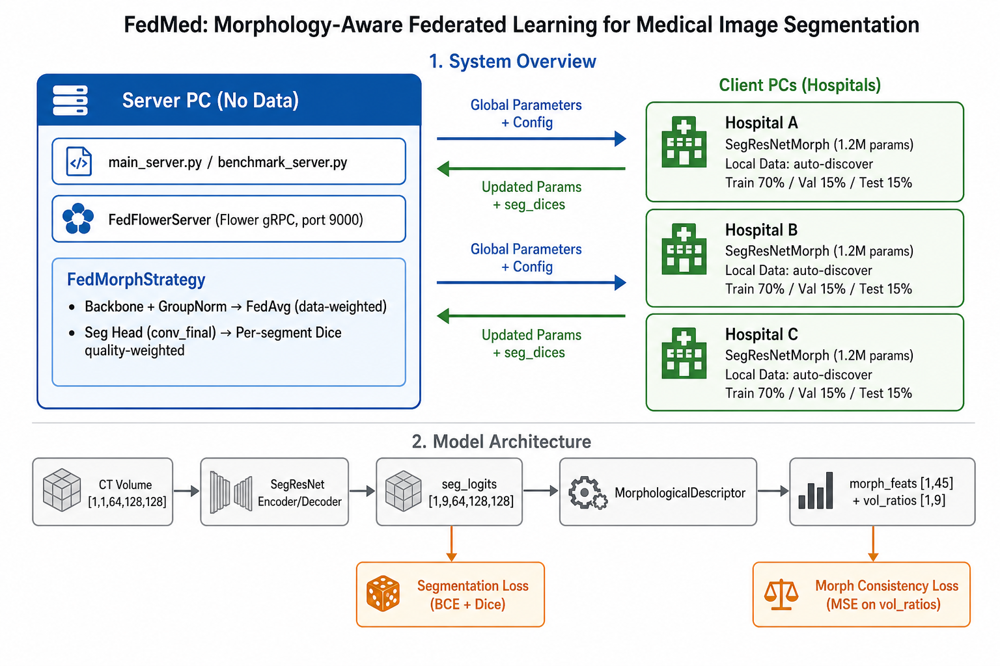

# FedMed

**FedMorph — Morphology-Aware Federated Learning for Medical Image Segmentation**

각 병원의 데이터는 외부로 반출되지 않고, 모델 가중치만 서버와 주고받는 실제 연합학습 구조.

## Architecture



```
┌──────────────────────────────────────────────────────────────────┐
│                                                                  │
│   병원 A (Client)          서버              병원 B (Client)      │
│   ┌──────────────┐    ┌──────────┐    ┌──────────────┐          │
│   │ 자체 CT 데이터 │    │ 데이터 없음 │    │ 자체 CT 데이터 │          │
│   │ 로컬 학습     │◄──►│ 모델 집계  │◄──►│ 로컬 학습     │          │
│   │ 가중치만 전송  │    │ 재배포     │    │ 가중치만 전송  │          │
│   └──────────────┘    └──────────┘    └──────────────┘          │
│                            ▲                                     │
│                            │                                     │
│                       ┌──────────────┐                          │
│                       │ 자체 CT 데이터 │                          │
│                       │ 로컬 학습     │                          │
│                       │ 가중치만 전송  │                          │
│                       └──────────────┘                          │
│                       병원 C (Client)                           │
│                                                                  │
└──────────────────────────────────────────────────────────────────┘
```

- **Model**: MONAI SegResNet + MorphologicalDescriptor (~1.2M params)
- **FL Framework**: [Flower](https://flower.ai/) (gRPC)
- **핵심**: 데이터는 각 병원에 머무르고, 모델 파라미터만 네트워크로 전송

| Parameter Group | Aggregation Strategy |
|----------------|---------------------|
| Backbone + GroupNorm | Data-size weighted average (FedAvg) |
| Segmentation head (`conv_final`) | Per-segment Dice quality × data-size weighted |

## Supported FL Methods

| Method | Description |
|--------|-------------|
| `FedAvg` | Standard weighted average |
| `FedProx` | FedAvg + proximal regularization term |
| `FedBN` | FedAvg with local normalization layers |
| `FedMorph` | Anatomy-Decoupled Aggregation (proposed) |

---

## Data Format

각 클라이언트(병원) PC의 **로컬 데이터 폴더** 안에 환자별 하위 폴더가 있어야 합니다.
별도의 메타파일(patient.json 등)은 필요 없습니다 — 자동으로 스캔합니다.

```
D:\data\liver_ct\               ← 각 병원의 로컬 경로
├── patient_001/
│   ├── image.npy              # CT volume, shape: (D, H, W)
│   └── mask.npy               # Segmentation mask, shape: (C, D, H, W)
├── patient_002/
│   ├── image.npy
│   └── mask.npy
└── ...
```

> 폴더명이 곧 환자 ID입니다. 어떤 이름이든 상관없습니다.

**mask.npy 채널 구성** (C >= 10):
- `mask[0]`: background
- `mask[1]` ~ `mask[9]`: 9개 간 세그먼트 (seg1 ~ seg8)

---

## 실행 가이드

### Step 1. 환경 설치 (모든 PC)

**1-1. Python 설치 (최초 1회)**

Python 3.11 또는 3.12를 설치합니다. (3.13은 일부 라이브러리 호환 문제가 있을 수 있습니다)

- **Windows**: https://www.python.org/downloads/ 에서 다운로드
  - 설치 시 **"Add Python to PATH"** 반드시 체크
- **Linux**: `sudo apt install python3.11 python3.11-venv` (Ubuntu/Debian)
- **macOS**: `brew install python@3.11`

설치 확인:
```bash
python --version   # Python 3.11.x 또는 3.12.x
```

**1-2. Git 설치 (최초 1회)**

- **Windows**: https://git-scm.com/download/win 에서 다운로드 → 기본값으로 설치
- **Linux**: `sudo apt install git`
- **macOS**: `brew install git`

**1-3. uv 설치 (최초 1회)**

```powershell
# Windows PowerShell
powershell -ExecutionPolicy ByPass -c "irm https://astral.sh/uv/install.ps1 | iex"
```

```bash
# Linux / macOS
curl -LsSf https://astral.sh/uv/install.sh | sh
```

> 설치 후 터미널을 **재시작**해야 `uv` 명령이 인식됩니다.

**1-4. 프로젝트 클론 & 의존성 설치**

```bash
git clone https://github.com/AISeedHub/FedMed.git
cd FedMed
uv sync
```

> `uv sync` 하나로 torch, monai, flwr 등 모든 의존성이 자동 설치됩니다.
> Windows에서는 CUDA 12.8 PyTorch가 자동으로 설치됩니다.

### Step 2. 더미 데이터로 사전 테스트 (선택)

실제 데이터 없이 환경, 통신, 전체 파이프라인을 빠르게 검증합니다.
테스트용 config(`configs/test.yaml`)를 사용하면 2라운드 × 2에폭으로 빠르게 끝납니다.

```bash
# 서버 (테스트 config, 4개 방법론)
uv run python src/use_cases/liver_segmentation/main_server.py --config src/use_cases/liver_segmentation/configs/test.yaml --methods FedAvg FedProx FedBN FedMorph

# 각 클라이언트 (준비 확인 → 더미 데이터 생성 → 테스트 학습, 한 줄로 실행)
uv run python tests/generate_dummy_data.py --out-dir tests/dummy_data --n-patients 10 && uv run python src/use_cases/liver_segmentation/check_ready.py --data-dir tests/dummy_data --server-address 192.168.1.100:443 && uv run python src/use_cases/liver_segmentation/main_client.py --config src/use_cases/liver_segmentation/configs/test.yaml --server-address 192.168.1.100:443 --data-dir tests/dummy_data --methods FedAvg FedProx FedBN FedMorph
```

클라이언트 실행 시 아래 항목이 자동으로 확인됩니다:

```
[1/4] Dependencies  — torch, monai, flwr 등
[2/4] GPU           — CUDA, VRAM 크기
[3/4] Local Data    — 환자 폴더 구조 검증
[4/4] Server        — TCP 포트 + gRPC 통신
```

> - 서버를 먼저 실행한 뒤 각 클라이언트 PC에서 실행
> - 모든 체크를 통과하면 더미 데이터 생성 → 테스트 학습이 자동 진행됩니다
> - 테스트 성공 후 `--config`를 `base.yaml`로, `--data-dir`을 실제 경로로 변경하면 됩니다

### Step 3. 서버 실행 (서버 PC)

서버를 **먼저** 실행합니다. 서버에는 **데이터가 필요 없습니다**.

```bash
# Linux
./src/run_liver_server.sh

# Windows
src\run_liver_server.bat
```

또는 직접:

```bash
# 단일 방법론 (config 기본값)
uv run python src/use_cases/liver_segmentation/main_server.py

# 여러 방법론 순차 실행 (벤치마크)
uv run python src/use_cases/liver_segmentation/main_server.py --methods FedAvg FedProx FedBN FedMorph
```

서버가 시작되면:

```
============================================================
  FedMorph - Liver Segmentation Server
============================================================
  Methods:     FedAvg, FedProx, FedBN, FedMorph
  Rounds/method: 50
  Min Clients: 3
============================================================
  [1/4] Starting method: FedAvg
  Waiting for 3 clients to connect...
```

### Step 4. 클라이언트 실행 (각 병원 PC)

서버 IP를 지정하여 실행합니다. **순서 무관**, 각자 로컬 데이터를 자동 스캔합니다.

```bash
# Windows
src\run_liver_client.bat 192.168.1.100:443 D:\data\liver_ct

# Linux
./src/run_liver_client.sh 192.168.1.100:443 /data/liver_ct
```

또는 직접:

```bash
# 단일 방법론 (config 기본값)
uv run python src/use_cases/liver_segmentation/main_client.py --server-address 192.168.1.100:443 --data-dir D:\data\liver_ct

# 여러 방법론 순차 참여 (서버와 동일한 --methods 순서로 지정)
uv run python src/use_cases/liver_segmentation/main_client.py --server-address 192.168.1.100:443 --data-dir D:\data\liver_ct --methods FedAvg FedProx FedBN FedMorph
```

> `--methods`를 사용하면 데이터 split이 한 번만 수행되어 모든 방법론에서 동일하게 적용됩니다.
> 서버 method 전환 시 접속이 끊겨도 클라이언트가 자동으로 재시도합니다 (최대 2분).

**데이터 경로 지정 방법 (우선순위 순):**

| 방법 | 예시 |
|------|------|
| 커맨드라인 인자 | `--data-dir D:\data\liver_ct` |
| 환경변수 | `set FEDMORPH_DATA_DIR=D:\data\liver_ct` |
| config YAML | `data_dir: "D:\data\liver_ct"` |

### Step 5. 학습 진행

모든 클라이언트가 접속하면 자동으로 시작됩니다.

```
[HOSPITAL-A] Data: D:\data\liver_ct
[HOSPITAL-A] Patients: 25 total (train 17, val 4, test 4)
[HOSPITAL-A] === Round 1 ===
[HOSPITAL-A] Epoch 3/10, Loss: 1.2345, LR: 0.000300
...
```

모든 라운드가 끝나면 각 클라이언트에서 **test set 최종 평가**가 자동 실행됩니다:

```
========================================================================
  FINAL TEST RESULTS — Client [HOSPITAL-A]
========================================================================
Metric               Global (Aggregated)   Local (Last Train)
------------------------------------------------------------------------
  Dice (mean)                      0.7234                 0.6891
  HD95 (mean)                      5.1200                 6.3400
  VR Error                         0.0312                 0.0456
------------------------------------------------------------------------
  Per-Segment Dice
    Seg 1                           0.8100                 0.7800
    Seg 2                           0.7500                 0.7200
    ...
========================================================================
  >> Global model wins (federated aggregation is effective)
========================================================================
```

- **Global**: 서버에서 집계된 모델
- **Local**: 각 센터에서 마지막으로 로컬 학습한 모델
- 모델 파일: `outputs/global_model_{id}.pth`, `outputs/local_model_{id}.pth`
- 결과 파일: `outputs/test_results_{id}.json`

---

## 벤치마크 (방법론 비교 실험)

4가지 FL 방법론(FedAvg, FedProx, FedBN, FedMorph)을 순차 실행하여 비교합니다.

```bash
# 서버
uv run python src/use_cases/liver_segmentation/main_server.py --methods FedAvg FedProx FedBN FedMorph

# 각 클라이언트
uv run python src/use_cases/liver_segmentation/main_client.py --server-address 192.168.1.100:443 --data-dir D:\data\liver_ct --methods FedAvg FedProx FedBN FedMorph
```

서버가 FedAvg → FedProx → FedBN → FedMorph 순서로 FL 세션을 실행하고,
클라이언트는 각 method마다 자동으로 재접속하여 학습에 참여합니다.

모든 method가 끝나면 각 클라이언트에서 비교표가 출력됩니다:

```
========================================================================
  BENCHMARK SUMMARY — Client [HOSPITAL-A]
========================================================================
  Method        Dice (G)   Dice (L)   HD95 (G)   HD95 (L)
------------------------------------------------------------------------
  FedAvg          0.6315     0.6102       7.55       8.12
  FedProx         0.3218     0.3050      10.68      11.20
  FedBN           0.4051     0.3900       8.74       9.10
  FedMorph *      0.6824     0.6500       6.54       7.00
========================================================================
  Best global Dice: FedMorph (0.6824)
========================================================================
```

특정 방법만 비교하려면:

```bash
# 서버
uv run python src/use_cases/liver_segmentation/main_server.py --methods FedAvg FedMorph

# 클라이언트
uv run python src/use_cases/liver_segmentation/main_client.py --server-address 192.168.1.100:443 --data-dir D:\data\liver_ct --methods FedAvg FedMorph
```

> 결과는 `outputs/benchmark/` 폴더에 method별 모델과 JSON 결과가 저장됩니다.

---

## 실행 흐름

```
┌─────────────────────────────────────────────────────────────┐
│                                                             │
│  서버 PC (데이터 없음)                                       │
│    run_liver_server.bat                                     │
│    → "Waiting for 3 clients..." 대기                        │
│                                                             │
│  병원 A PC (자체 데이터: D:\data\liver_ct)                   │
│    run_liver_client.bat 192.168.1.100:443 D:\data\liver_ct │
│    → 자동 스캔: 25명 → train 17 / val 4 / test 4            │
│                                                             │
│  병원 B PC (자체 데이터: E:\ct_data)                         │
│    run_liver_client.bat 192.168.1.100:443 E:\ct_data       │
│    → 자동 스캔: 30명 → train 21 / val 5 / test 4            │
│                                                             │
│  병원 C PC (자체 데이터: C:\medical\liver)                   │
│    run_liver_client.bat 192.168.1.100:443 C:\medical\liver │
│    → 자동 스캔: 18명 → train 12 / val 3 / test 3            │
│                                                             │
│  → 3개 접속 완료 → 50 rounds 자동 학습 시작                  │
│  → 각 라운드: 모델 배포 → 로컬 학습 → 가중치 수집 → 집계     │
│                                                             │
└─────────────────────────────────────────────────────────────┘
```

---

## 네트워크 요구사항

| 항목 | 서버 PC | 클라이언트 PC |
|------|---------|--------------|
| 고정 IP | **필요** (또는 DDNS) | 불필요 |
| 포트 개방 | **443번 인바운드** | 불필요 |
| 데이터 | 없음 | 자체 로컬 데이터만 |

**Windows 방화벽 포트 개방 (서버 PC만):**

```powershell
netsh advfirewall firewall add rule name="FedMorph Server" dir=in action=allow protocol=TCP localport=443
```

---

## Configuration

`src/use_cases/liver_segmentation/configs/base.yaml`:

```yaml
method: "FedMorph"        # FedAvg | FedProx | FedBN | FedMorph
fl_rounds: 50
min_clients: 4
local_epochs: 10
data_dir: "./data"        # 각 PC에서 오버라이드
```

## Project Structure

```
src/
  fed_core/
    fed_server.py              # Flower server wrapper
    fed_client.py              # Abstract FL client base
    fedmorph_strategy.py       # FedMorph aggregation strategy
  use_cases/liver_segmentation/
    configs/base.yaml          # Training & FL configuration
    models/
      segresnet_morph.py       # SegResNet + MorphologicalDescriptor
    utils/
      dataset.py               # 9-segment liver CT dataset + auto-discover
      loss.py                  # Seg + Morph consistency loss
      metrics.py               # Dice / HD95 evaluation
    main_server.py             # FL server (single or multi-method via --methods)
    main_client.py             # FL client (single or multi-method via --methods)
    benchmark_server.py        # Multi-method benchmark server (alternative)
    benchmark_client.py        # Multi-method benchmark client (alternative)
    check_ready.py             # Client readiness check (deps, GPU, data, server)
    prepare_client_data.py     # Local data validation tool
  run_liver_server.bat/.sh     # Server launch scripts
  run_liver_client.bat/.sh     # Client launch scripts
tests/
  generate_dummy_data.py       # Dummy CT data generator
  test_e2e_aggregation.py      # In-process FL simulation test
  test_fl_communication.py     # Real gRPC communication test
```

## Acknowledgments

Built on the [AISeedHub/FedFace](https://github.com/AISeedHub/FedFace) federated learning framework.
